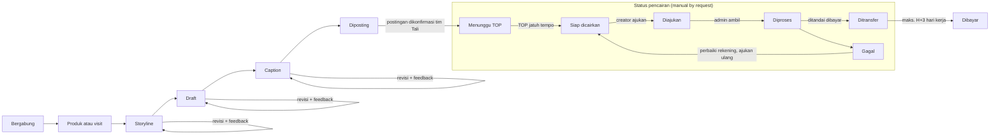

# PRD — Tali, Influencer Campaign Platform (MVP)

Per 6 Oktober 2026

## Ringkasan

MVP Tali adalah PWA mobile-first tempat tim Tali mengkurasi job campaign dari klien brand untuk nano dan micro creator, lalu creator mencairkan fee setelah posting dengan status yang selalu terlihat. Pasar awal Indonesia, disiapkan untuk ekspansi Asia Tenggara dan global.

**Masalah yang diselesaikan**

- **Creator kecil (ribuan–puluhan ribu followers)** sering tidak tahu kapan dan berapa mereka dibayar, dan status konten mereka tidak jelas.
- **Tim Tali** menangani klien brand secara langsung dan perlu satu tempat untuk mengkurasi job, memilih creator, mereview konten, dan memproses pencairan manual ke banyak creator.

**Janji brand yang harus dibuktikan setiap fitur:** *Trusted. Dibayar tepat waktu. Membantu creator menghasilkan.* Status pembayaran harus selalu jelas, transparan, dan mudah ditemukan.

**Scope MVP (6 modul):** onboarding creator, daftar dan detail job, eksekusi job (produk/visit, storyline, draft, caption) dengan timeline status, kurasi campaign oleh tim Tali, saldo dan riwayat pencairan creator, serta pencairan manual by request. Platform yang didukung: Instagram, TikTok, YouTube, Threads, dan X. Ada dua tipe job: non-visit (sesuai SOW: produk dikirim klien, dibeli sendiri, atau tanpa produk) dan visit (creator datang ke lokasi, mis. toko, sesuai jadwal).

**Dua keputusan yang mengubah scope awal:**

1. **Brand bukan pengguna aplikasi.** Klien brand ditangani tim Tali di luar aplikasi; tim Tali yang membuat dan mengkurasi job, memilih creator, dan mereview konten.
2. **Pencairan manual by request.** Setelah posting dan sesuai term of payment (TOP) campaign, creator mengajukan pencairan; admin mentransfer manual maksimal H+3 hari kerja (secepat mungkin) setelah request lalu menandai pencairan sudah dibayar. Xendit Disbursement ditunda ke setelah MVP.

Sumber: dokumen scope terlampir (`CLAUDE.md`, `BRAND.md`, brand kit Tali).

## Tujuan, non-tujuan, dan metrik sukses

MVP berhasil jika satu campaign bisa berjalan ujung ke ujung, dari kurasi job sampai fee ditransfer, dan setiap creator tahu nominal, tanggal, dan status pencairannya tanpa bertanya.

**Tujuan**

1. Tim Tali dapat membuat dan mengkurasi job, memilih creator, mereview konten, dan memproses pencairan dari satu dashboard admin.
2. Creator dapat bergabung ke job dengan fee, syarat, deadline, dan term of payment (TOP) yang terlihat sebelum bergabung.
3. Setiap pencairan ditransfer maksimal H+3 hari kerja setelah creator mengajukan, dan status serta tanggal transfernya bisa dilihat creator.
4. Aplikasi ringan dan cepat di HP entry-level dengan koneksi lambat.

**Non-tujuan MVP**

- Akun dan dashboard self-serve untuk brand. Klien brand ditangani tim Tali di luar aplikasi.
- Pencairan otomatis via Xendit Disbursement. MVP memakai transfer manual oleh admin.
- Pembayaran brand di dalam aplikasi (invoice, VA, QRIS).
- Integrasi API platform sosial otomatis (verifikasi akun dan metrik konten). MVP memakai input manual.
- Aplikasi native iOS/Android. MVP hanya PWA.
- Chat real-time tim Tali–creator.
- Multi-mata uang dan pasar di luar Indonesia (i18n `en` disiapkan, transaksi hanya rupiah).
- Pemotongan PPh dan bukti potong atas fee creator.
- eKYC (KTP) untuk creator.
- Reimburse pembelian produk untuk job visit.
- Laporan atau akses baca untuk klien di aplikasi, termasuk setelah MVP.

**Metrik sukses**

Target angka belum ditetapkan di scope; diisi bersama tim sebelum pilot.

| Metrik | Definisi | Target |
| --- | --- | --- |
| Pencairan tepat SLA (north star) | % pencairan berstatus `ditransfer` maksimal H+3 hari kerja setelah diajukan | Ditentukan |
| Pencairan gagal | % pencairan berstatus `gagal` dari total pengajuan | Ditentukan |
| Aktivasi creator | % pendaftar yang menyelesaikan onboarding (profil + minimal satu akun sosial terverifikasi) | Ditentukan |
| Job terisi | % slot creator yang terisi sebelum deadline pendaftaran | Ditentukan |
| Waktu review konten | Median jam dari konten dikirim sampai disetujui/ditolak tim Tali | Ditentukan |
| Creator aktif berulang | % creator yang menyelesaikan job kedua dalam 90 hari | Ditentukan |

## Persona dan peran pengguna

Aplikasi punya dua peran pengguna: creator dan tim Tali (admin). Brand adalah klien tim Tali, bukan pengguna aplikasi.

| Peran | Siapa | Kebutuhan utama | Sapaan di copy |
| --- | --- | --- | --- |
| Creator | Nano dan micro creator Instagram, TikTok, YouTube, Threads, dan X (ribuan–puluhan ribu followers), banyak memakai HP entry-level | Menemukan job yang jelas fee dan TOP-nya, mengirim konten dengan mudah, mencairkan fee tepat waktu ke bank atau e-wallet | "kamu" |
| Tim Tali — kurator campaign | Tim internal yang menerima brief dari klien brand | Membuat dan mengkurasi job, memilih creator, mereview konten sesuai brief klien | Internal |
| Tim Tali — admin keuangan | Tim internal yang memegang rekening Tali | Melihat antrean pencairan, mentransfer manual maksimal H+3 hari kerja, menandai pencairan sudah dibayar | Internal |
| Brand / agensi (bukan pengguna) | Klien yang memberi brief dan dana ke Tali di luar aplikasi | Menerima laporan konten dari tim Tali (di luar aplikasi pada MVP) | — |

Kurator dan admin keuangan bisa dipegang orang yang sama di awal, tetapi diberi hak akses terpisah agar konfirmasi transfer tercatat atas nama admin keuangan.

## Scope fitur per modul

Enam modul MVP mengikuti urutan di scope. Kolom "Di luar MVP" adalah batas yang sengaja ditunda.

| # | Modul | Pengguna | Termasuk MVP | Di luar MVP |
| --- | --- | --- | --- | --- |
| M1 | Onboarding creator | Creator | Daftar (email/Google/OTP), profil, hubungkan akun Instagram, TikTok, YouTube, Threads, dan X lewat link profil (username diekstrak otomatis, followers diisi manual), persetujuan syarat dan privasi | Verifikasi akun via API resmi, eKYC otomatis |
| M2 | Daftar dan detail job | Creator | Daftar job yang buka, filter dasar (platform, kategori), detail berisi fee, syarat, deadline, TOP; tombol bergabung | Rekomendasi personal, pencarian lanjutan |
| M3 | Eksekusi job + timeline status | Creator, Tim Tali | Konfirmasi alamat dan status produk (non-visit) atau lokasi, jadwal, dan bukti beli (visit); storyline (Google Docs), draft (Google Drive/foto, revisi tanpa batas), dan caption yang masing-masing wajib diapprove; feedback dan riwayat per versi, tautan dan tanggal posting, timeline status dari Bergabung sampai Dibayar | Tarik metrik postingan otomatis |
| M4 | Kurasi campaign oleh tim Tali | Tim Tali | Buat job dari brief klien (fee, kuota, syarat, deadline, TOP), undang/setujui creator, review storyline dan konten (setujui, minta revisi dengan feedback, tolak), konfirmasi postingan tayang | Akun brand, portal laporan untuk klien |
| M5 | Saldo + riwayat pencairan | Creator | Saldo per status (menunggu TOP, siap dicairkan, diajukan, ditransfer), tombol ajukan pencairan, riwayat dengan tanggal transfer | Ekspor laporan pajak |
| M6 | Pencairan manual by request | Creator, Admin keuangan | Pengajuan pencairan setelah posting sesuai TOP (data rekening diisi saat pengajuan pertama), antrean admin dengan SLA maks. H+3 hari kerja, transfer manual, admin menandai sudah dibayar, notifikasi ke creator | Xendit Disbursement otomatis, pencairan instan |

## User flow utama

Alur inti MVP adalah satu partisipasi creator dari bergabung ke job sampai fee ditransfer, dan setiap langkahnya terlihat di timeline creator maupun dashboard tim Tali.

Setelah tim Tali mengonfirmasi postingan, fee menunggu TOP job; begitu jatuh tempo, creator bisa mengajukan pencairan. Admin keuangan mentransfer manual maksimal H+3 hari kerja setelah pengajuan lalu menandainya sudah dibayar, sehingga status `Dibayar` tampil di timeline.

**Siapa melakukan apa**

1. **Kurator Tali** membuat job dari brief klien (tipe visit atau non-visit), lalu mengundang creator atau membuka job untuk umum.
2. **Creator** melihat fee, syarat, deadline, dan TOP, lalu bergabung; kurator menyetujui.
3. **Persiapan:** untuk non-visit, bila produk dikirim klien, status pengiriman ditampilkan sebagai informasi; untuk visit, creator datang ke lokasi sesuai jadwal (bukti pembelian bila diminta).
4. **Creator** mengirim storyline (Google Docs); kurator dan brand memberi feedback sampai disetujui. Langkah ini bisa berjalan bersamaan dengan langkah 3.
5. **Creator** mengirim draft dan caption (revisi bisa berkali-kali); masing-masing harus disetujui.
6. **Creator** memposting dan mengirim tautan serta tanggal posting; kurator mengonfirmasi tayang.
7. **Creator** mengajukan pencairan setelah TOP jatuh tempo.
8. **Admin keuangan** mentransfer manual maksimal H+3 hari kerja dan menandai pencairan sudah dibayar; creator menerima notifikasi.

## Kebutuhan fungsional dan acceptance criteria

Setiap kebutuhan punya ID agar bisa dirujuk di tiket dan pengujian. P0 = wajib untuk pilot, P1 = boleh menyusul di MVP.

### M1 — Onboarding creator

1. **FR-1.1 (P0) Daftar dan masuk.** Creator mendaftar dengan email + OTP atau Google via Supabase Auth.
   - Akun baru langsung masuk ke langkah onboarding; sesi bertahan setelah PWA ditutup.
   - Onboarding hanya meminta profil dan minimal satu akun sosial. Data rekening tidak diminta di awal, tetapi saat pengajuan pencairan pertama (FR-6.7).
2. **FR-1.2 (P0) Profil creator.** Nama, kota, kategori konten (maks. 3), persona, nomor HP, dan alamat pengiriman default untuk job non-visit.
3. **FR-1.3 (P0) Hubungkan akun sosial lewat link.** Creator menempelkan link profil Instagram, TikTok, YouTube, Threads, atau X (bisa lebih dari satu). Sistem mengenali platform dan mengekstrak username/handle dari link; jumlah followers (subscribers untuk YouTube) diisi manual.
   - Pola link yang dikenali: instagram.com/{username}, tiktok.com/@{username}, youtube.com/@{handle}, threads.net atau threads.com/@{username}, x.com atau twitter.com/{username}. Parameter seperti `?igsh=` atau `?_r=` dibuang.
   - Bila username tidak bisa diekstrak (mis. youtube.com/channel/…), creator diminta mengisi handle secara manual.
   - Satu akun sosial hanya bisa terdaftar di satu akun creator.
   - Status: `menunggu verifikasi` → `terverifikasi` / `ditolak`. Kurator membuka link dan mencocokkan jumlah followers; tidak perlu screenshot. Kurator bisa memperbarui jumlah followers saat mengecek ulang.
4. **FR-1.4 (P0) Persetujuan.** Creator menyetujui syarat layanan dan kebijakan privasi (UU PDP) sebelum bisa bergabung ke job.

### M2 — Daftar dan detail job

1. **FR-2.1 (P0) Daftar job.** Kartu job menampilkan nama brand klien, fee (`Rp 750.000`), platform, deadline, dan TOP; job open rate menampilkan label "Open rate" sebagai pengganti nominal.
   - Daftar kosong menampilkan copy yang mengarahkan, bukan "Tidak ada data".
2. **FR-2.2 (P1) Filter.** Platform (Instagram, TikTok, YouTube, Threads, X) dan kategori.
3. **FR-2.3 (P0) Detail job.** Brief, deliverable, syarat (min. followers, kategori), fee, kuota creator, deadline kirim konten, dan TOP (mis. "Bisa dicairkan 7 hari setelah postingan tayang").
   - Fee dan TOP terlihat tanpa scroll di layar 360 px sebelum tombol bergabung.
4. **FR-2.4 (P0) Bergabung.** Creator yang punya akun terverifikasi di platform job dan memenuhi syarat menekan "Gabung job"; status menjadi `Menunggu kurasi` sampai tim Tali menyetujui atau menolak. Untuk job open rate, creator mengisi rate yang diajukan (Rp) saat bergabung; kurator menyetujui dengan fee yang disepakati, dan fee itulah yang dipakai untuk pencairan.
   - Creator yang belum menyelesaikan onboarding diarahkan ke langkah yang kurang.

### M3 — Eksekusi job: produk/visit, storyline, draft, caption

1. **FR-3.1 (P0) Persiapan job non-visit.** Sesuai SOW, produk bisa dikirim klien, dibeli sendiri oleh creator (biasanya sudah termasuk fee), atau tidak ada. Bila dikirim, creator mengonfirmasi alamat pengiriman (default dari profil, bisa diubah per job). Kurator mencatat status produk: `menunggu dikirim` → `dikirim` (kurir dan nomor resi) → `diterima`; creator juga bisa menandai produk sudah diterima. Status ini hanya informasi; pengiriman dan ongkir diurus di luar aplikasi.
   - Alamat dan nomor HP hanya terlihat oleh tim Tali.
2. **FR-3.2 (P0) Persiapan job visit.** Creator melihat lokasi visit (nama tempat, alamat, tautan Google Maps; bisa lebih dari satu pilihan) dan jadwal visit. Bukti pembelian (foto struk) opsional per job; tidak ada reimburse di MVP.
3. **FR-3.3 (P0) Kirim storyline.** Setelah disetujui bergabung, creator mengirim storyline sebagai tautan Google Docs.
   - Tautan harus berupa URL docs.google.com; creator diingatkan mengatur akses ke "Siapa saja yang memiliki link" (minimal bisa berkomentar).
4. **FR-3.4 (P0) Kirim draft konten.** Draft baru bisa dikirim setelah storyline disetujui; status produk atau visit ditampilkan sebagai informasi dan tidak mengunci. Video dikirim sebagai tautan Google Drive (file atau folder), foto diunggah ke Supabase Storage.
   - Revisi tidak dibatasi; setiap putaran tercatat sebagai versi baru (Draft, Revisi I, Revisi II, dan seterusnya) dan jumlah revisi terlihat oleh kurator.
   - Tautan harus berupa URL drive.google.com dengan akses "Siapa saja yang memiliki link". Batas ukuran foto ditampilkan; error menyebut penyebab dan langkah berikutnya.
5. **FR-3.5 (P0) Kirim caption.** Creator mengirim caption (teks + hashtag) untuk diapprove, bersamaan dengan draft atau setelah draft disetujui.
6. **FR-3.6 (P0) Review, feedback, dan riwayat.** Berlaku untuk storyline, draft, dan caption.
   - Status per item: `menunggu review` → `dikirim ke brand` → `disetujui brand` / `perlu revisi` / `ditolak`.
   - Kurator mencatat feedback dari dua sumber secara terpisah: tim Tali dan brand (brand memberi feedback di luar aplikasi).
   - Setiap versi tersimpan sebagai riwayat: label versi (mis. Draft, Revisi I, Revisi II), tautan atau teks, waktu kirim, keputusan, feedback, nama kurator, dan waktu review. Creator dan kurator melihat riwayat yang sama, urut dari versi terbaru.
   - Waktu persetujuan dicatat, karena isi Google Docs/Drive bisa berubah setelah disetujui.
7. **FR-3.7 (P0) Timeline status.** Bergabung → Produk diterima / Visit selesai (bila ada) → Storyline disetujui → Draft disetujui → Caption disetujui → Diposting → Pencairan diajukan → Dibayar, dengan tanggal di tiap langkah dan jumlah revisi.
8. **FR-3.8 (P0) Posting.** Setelah draft dan caption disetujui, creator memposting lalu mengirim URL postingan dan tanggal posting; sistem mengecek username di URL cocok dengan akun terdaftar (untuk link pendek seperti vt.tiktok.com, kurator yang mengecek); tim Tali mengonfirmasi postingan tayang. Tanggal konfirmasi ini menjadi awal hitungan TOP.
9. **FR-3.9 (P0) Notifikasi.** Web Push + email saat diundang, disetujui bergabung, produk dikirim, pengingat jadwal visit, storyline/draft/caption disetujui atau perlu revisi (beserta feedback), ditolak, job siap dicairkan, dan saat pencairan berubah status.

### M4 — Kurasi campaign oleh tim Tali

1. **FR-4.1 (P0) Data klien brand.** Kurator mencatat klien (nama brand, PIC, catatan) sebagai data internal; klien tidak punya akun.
2. **FR-4.2 (P0) Buat job.** Judul, brand klien, produk, tipe job (visit atau non-visit), fase campaign (mis. awareness, amplification), brief, platform dan format deliverable (mis. Instagram Reels, video TikTok, YouTube Shorts, post Threads, post X; satu job bisa mencakup beberapa platform dengan satu fee gabungan), syarat creator (tier nano/micro, persona, min. followers), tipe fee (fix rate: fee ditetapkan tim Tali; open rate: creator mengajukan rate saat bergabung), fee per creator untuk fix rate, batas waktu review (sesuai terms klien), opsi produk (dikirim klien, beli sendiri dan sudah termasuk fee, atau tanpa produk), kuota, deadline, dan TOP (H+7, H+14, atau H+30 setelah postingan dikonfirmasi tayang).
   - Job bisa disimpan sebagai draft dan baru tayang setelah dipublikasikan kurator.
3. **FR-4.3 (P0) Kurasi creator.** Kurator melihat pelamar (profil, followers, kategori) dan menyetujui/menolak, atau mengundang creator langsung.
4. **FR-4.4 (P0) Review storyline dan konten.** Kurator mereview internal, meneruskan ke brand klien di luar aplikasi, lalu mencatat keputusan akhir (setujui, minta revisi, atau tolak) beserta feedback tim Tali dan feedback brand secara terpisah. Lihat FR-3.6.
   - Storyline dan konten yang belum direview lebih dari batas waktu review job (sesuai terms klien) ditandai di dashboard.
5. **FR-4.5 (P0) Konfirmasi postingan.** Kurator mengecek URL postingan dan menandai tayang; sistem menghitung tanggal siap dicairkan dari TOP.
6. **FR-4.6 (P1) Ringkasan job.** Jumlah creator per status dan total fee yang sudah/akan dicairkan, untuk dilaporkan ke klien di luar aplikasi.
7. **FR-4.7 (P0) Logistik produk dan visit.** Untuk non-visit, kurator melihat alamat creator terpilih dan mencatat status pengiriman sebagai informasi (kurir, nomor resi, status). Untuk visit, kurator mengatur lokasi dan jadwal per creator, lalu memeriksa bukti pembelian bila diwajibkan.

### M5 — Saldo + riwayat pencairan

1. **FR-5.1 (P0) Kartu saldo.** Elemen paling menonjol di dashboard creator: total siap dicairkan, tombol "Ajukan pencairan", dan total menunggu TOP beserta tanggal siapnya.
   - Contoh setelah mengajukan: "Rp 750.000 akan ditransfer ke BCA •••4417 paling lambat Jumat, 16 Okt."
2. **FR-5.2 (P0) Riwayat pencairan.** Daftar pengajuan dengan job terkait, nominal, status, tanggal pengajuan, tanggal transfer, dan alasan bila gagal.
3. **FR-5.3 (P0) Format uang.** Disimpan sebagai integer rupiah, ditampilkan `Intl.NumberFormat('id-ID')` dengan `tabular-nums`.

### M6 — Pencairan manual by request

1. **FR-6.1 (P0) Jatuh tempo TOP.** Setelah postingan dikonfirmasi, fee job berstatus `menunggu TOP` lalu otomatis menjadi `siap dicairkan` pada tanggal TOP.
2. **FR-6.2 (P0) Ajukan pencairan.** Creator memilih satu atau beberapa job yang `siap dicairkan` dan mengirim pengajuan ke rekening tujuan; status `diajukan` dan tenggat transfer (tanggal pengajuan + 3 hari kerja, tidak termasuk Sabtu, Minggu, dan libur nasional) langsung tampil. Biaya transfer ditanggung creator: layar pengajuan menampilkan total fee, biaya transfer, dan jumlah bersih yang diterima.
   - Tombol tidak aktif bila belum ada job siap dicairkan, dengan penjelasan. Bila rekening belum pernah diisi, creator diminta mengisinya dulu (FR-6.7) sebelum pengajuan terkirim.
3. **FR-6.3 (P0) Antrean admin.** Admin keuangan melihat pengajuan diurutkan dari tenggat terdekat, dengan nominal, nama bank, nomor rekening lengkap, dan nama pemilik; pengajuan yang mendekati atau melewati tenggat (H+3 hari kerja) ditandai.
4. **FR-6.4 (P0) Transfer dan update status.** Admin menandai `diproses`, mentransfer manual dari rekening Tali, lalu mengisi tanggal transfer dan catatan opsional (mis. nomor referensi bank); status menjadi `ditransfer`.
   - Status `ditransfer` hanya bisa diubah admin keuangan dan wajib disertai tanggal transfer; tidak ada unggah bukti transfer.
   - Creator menerima notifikasi berisi nominal, rekening tujuan tersamar, dan tanggal transfer; kendala transfer diselesaikan admin lewat kontak creator (nomor HP).
5. **FR-6.5 (P0) Pencairan gagal.** Admin menandai `gagal` dengan alasan (mis. nama rekening tidak cocok); creator memperbaiki rekening dan mengajukan ulang.
6. **FR-6.6 (P0) Jejak audit.** Setiap perubahan status pencairan tercatat dengan waktu dan admin yang mengubahnya; status dibayar hanya bisa dibatalkan admin dengan alasan.
7. **FR-6.7 (P0) Data rekening saat pencairan.** Pada pengajuan pertama, creator mengisi bank atau e-wallet, nomor rekening, dan nama pemilik. Pengajuan berikutnya memakai rekening tersimpan dan bisa diganti sebelum dikirim. Nomor rekening dienkripsi dan selalu ditampilkan tersamar (BCA •••4417). Admin mencocokkan nama pemilik saat transfer; jika tidak cocok, pencairan ditandai gagal dan creator memperbaiki rekening.

## Kebutuhan non-fungsional

Kebutuhan non-fungsional MVP dipandu tiga hal: HP spek rendah, data uang dan data pribadi, serta kesiapan ekspansi.

| Kategori | Kebutuhan |
| --- | --- |
| Performa | Mobile-first, diuji di lebar 360 px; aset ringan, tanpa gambar berat; target angka (mis. LCP di jaringan 3G) ditetapkan tim engineering |
| PWA | Installable via Serwist, offline cache untuk shell aplikasi dan riwayat terakhir; manifest dan ikon sesuai brand kit |
| Notifikasi | Web Push via service worker + email (Resend); di iOS push hanya berjalan bila PWA di-install ke home screen, jadi email wajib sebagai cadangan |
| Keamanan data | Row Level Security di semua tabel Supabase; creator hanya membaca datanya sendiri; kurator dan admin keuangan punya hak akses terpisah sesuai peran |
| Privasi (UU PDP) | Minimalkan data yang dikumpulkan (tanpa KTP/eKYC); rekening, alamat pengiriman, dan nomor HP disimpan terenkripsi; nomor rekening lengkap hanya terlihat oleh admin keuangan, ke creator selalu tersamar |
| Integritas uang | Nominal disimpan sebagai integer rupiah; status ditransfer hanya diubah admin keuangan dan wajib disertai tanggal transfer; SLA transfer maksimal H+3 hari kerja dipantau di dashboard admin; jejak audit untuk setiap perubahan status pencairan |
| i18n | Semua teks UI via next-intl (`id` default, `en`); tidak ada copy yang di-hardcode |
| Aksesibilitas | Kontras teks min. 4.5:1 (3:1 untuk teks ≥ 24 px); touch target min. 44×44 px |
| Brand dan UI | Warna hanya dari token Nila & Limau (`tokens.css`); font Plus Jakarta Sans; logo dari file SVG, bukan teks |
| Infrastruktur | Railway (aplikasi + cron) dan Supabase paket gratis, keduanya di region Singapura |
| Observabilitas | Sentry untuk error, PostHog untuk analytics funnel dan metrik sukses |

## Integrasi, data, dan asumsi

Stack mengikuti keputusan di scope: Next.js (App Router) + TypeScript, Tailwind v4 + shadcn/ui, dan Supabase (paket gratis dulu). Aplikasi di-deploy di Railway, bukan Vercel, karena tim sudah terbiasa dan cron tersedia bawaan. Xendit (tercantum di stack awal) ditunda karena pencairan MVP dilakukan manual.

**Integrasi pihak ketiga**

| Layanan | Dipakai untuk | Modul |
| --- | --- | --- |
| Supabase Auth | Daftar dan masuk creator serta tim Tali | M1, M4 |
| Supabase Postgres + RLS | Data utama dan kontrol akses per peran | Semua |
| Supabase Storage (bucket privat) | Foto konten dan bukti pembelian visit (video draft lewat tautan Google Drive) | M3 |
| Resend | Email transaksional | M3, M6 |
| Web Push | Notifikasi status | M3, M6 |
| Sentry, PostHog | Error dan analytics | Semua |
| Railway | Hosting aplikasi Next.js (region Singapura) dan cron harian: TOP jatuh tempo, pengingat SLA H+3 hari kerja | Semua |
| Google Docs/Drive (tautan saja) | Creator membagikan storyline (Docs) dan video draft (Drive) lewat tautan; tanpa integrasi API | M3 |
|  | ini&#32; |  |

**Entitas data inti**

| Entitas | Isi utama |
| --- | --- |
| `profiles` | Pengguna dan perannya (creator, kurator, admin keuangan) |
| `creator_profiles` | Kota, kategori, status onboarding |
| `social_accounts` | Platform, link profil, username (diekstrak dari link), followers (manual), status verifikasi |
| `payout_accounts` | Bank/e-wallet, nomor terenkripsi, 4 digit terakhir, nama pemilik |
| `clients` | Brand klien (data internal, tanpa akun) |
| `jobs` | Klien, produk, tipe (visit/non-visit), fase campaign, platform, brief, syarat (tier, persona), fee (integer rupiah), kuota, tipe fee (fix rate/open rate), batas waktu review, opsi produk, deadline, TOP (H+7/H+14/H+30), lokasi visit, status |
| `participations` | Creator × job, fee yang disepakati (dan rate yang diajukan untuk open rate), status timeline beserta tanggalnya, tanggal postingan dikonfirmasi, tanggal siap dicairkan, alamat pengiriman (snapshot), status produk dan resi, jadwal visit, bukti pembelian |
| `content_submissions` | Tipe (storyline, draft konten, atau caption), nomor versi, tautan Google Docs/Drive atau foto, tautan postingan final; setiap versi menyimpan keputusan review, feedback tim Tali, feedback brand, kurator, dan waktunya |
| `payout_requests` | Creator, job yang dicairkan, nominal (total fee, biaya transfer, jumlah bersih), rekening tujuan, status, tanggal pengajuan, tenggat (H+3 hari kerja), tanggal transfer, catatan opsional, admin |
| `payout_events` | Jejak audit perubahan status pencairan |

**Asumsi**

- Klien brand membayar ke Tali di luar aplikasi; fee creator dibayar dari rekening Tali.
- Satu partisipasi menghasilkan satu fee sebesar fee yang disepakati: fix rate dari job atau rate creator yang disetujui (open rate); bukan berbasis performa.
- TOP dihitung dalam hari sejak tim Tali mengonfirmasi postingan tayang, dan bisa berbeda per job. Pilihan TOP: H+7, H+14, atau H+30.
- Verifikasi akun sosial dan konfirmasi postingan tayang dilakukan manual oleh tim Tali di MVP.

## Rilis bertahap, risiko, dan pertanyaan terbuka

Rilis MVP dibagi empat tahap, ditambah satu tahap setelah MVP; tanggal belum ditetapkan di scope. Setiap tahap baru dimulai setelah kriteria tahap sebelumnya terpenuhi.

1. **Fondasi** — setup Next.js, Supabase (RLS per peran), token brand, i18n, PWA shell, landing page. Selesai bila PWA installable dan lolos audit kontras.
2. **Kurasi + alur creator** — M1, M2, M3, M4. Selesai bila kurator bisa membuat job dan creator uji bisa mendaftar sampai postingan dikonfirmasi tayang.
3. **Saldo + pencairan manual** — M5, M6. Selesai bila satu job uji berjalan dari TOP jatuh tempo, pengajuan, transfer, sampai status dibayar terlihat creator, dan pencairan `gagal` tertangani.
4. **Pilot tertutup** — beberapa klien dan creator undangan, transfer sungguhan dari rekening Tali. Dievaluasi dengan metrik sukses, terutama kepatuhan SLA H+3 hari kerja.
5. **Setelah MVP** — otomatisasi pencairan via Xendit Disbursement bila volume pengajuan melampaui kapasitas admin.

**Risiko**

| Risiko | Dampak | Mitigasi |
| --- | --- | --- |
| Transfer melewati H+3 hari kerja (admin libur, antrean menumpuk) | Merusak janji "dibayar tepat waktu" | Antrean diurutkan per tenggat, penanda mendekati SLA, notifikasi ke admin cadangan |
| Salah transfer (nominal atau rekening keliru) | Kerugian dana dan kepercayaan | Data rekening lengkap ditampilkan dari sistem, bukan diketik ulang; tanggal transfer wajib; audit trail; konfirmasi langsung ke creator bila ragu |
| Rekening creator salah atau nama tidak cocok | Pencairan gagal | Cek nama saat transfer; alasan gagal jelas; creator memperbaiki dan mengajukan ulang |
| Pencairan manual tidak skalabel | Beban admin naik seiring jumlah creator | Pantau jumlah pengajuan per hari; siapkan Xendit Disbursement setelah MVP |
| Arus kas: creator dibayar sebelum klien membayar Tali | Tali menalangi fee | Atur TOP job sesuai termin pembayaran klien |
| Push notification tidak jalan di iOS tanpa install | Creator melewatkan update status | Email sebagai cadangan; ajakan install PWA |
| Nama "Tali" belum terdaftar merek (kelas 9 dan 42; mirip "TALLY") | Risiko rebranding | Selesaikan cek PDKI sebelum materi dicetak massal |
| Batas paket gratis Supabase (project di-pause bila tidak aktif sekitar seminggu, kuota database dan storage kecil) | Aplikasi tidak bisa diakses atau upload gagal | Video lewat Google Drive agar storage hemat; pantau kuota; upgrade ke Pro sebelum pilot dengan transfer sungguhan |
| Tautan Google Docs/Drive privat, dihapus, atau isinya diubah setelah disetujui | Kurator tidak bisa mereview, atau versi yang disetujui hilang | Validasi URL dan instruksi akses; waktu persetujuan dicatat dan riwayat versi Google Docs dicek bila ada sengketa; kurator minta revisi bila tidak bisa dibuka; postingan final tetap dicek lewat URL platform |
| Creator mendaftarkan akun sosial milik orang lain atau mengisi followers tidak sesuai | Brand mendapat creator yang tidak sesuai syarat | Kurator mengecek followers lewat link; satu akun sosial hanya untuk satu creator; URL postingan final harus dari akun terdaftar |

**Pertanyaan terbuka**

- [x] H+1 dihitung hari kalender atau hari kerja? Bagaimana pengajuan di hari Sabtu, Minggu, dan libur nasional? Maks H+3 Hari Kerja. tapi pasti secepat mmungkin
- [ ] Apakah ada nominal minimum pencairan, dan siapa yang menanggung biaya transfer antarbank atau e-wallet? user
- [x] Apakah creator boleh menggabungkan beberapa job dalam satu pengajuan? boleh
- [x] Pilihan TOP apa saja yang dipakai (mis. 0, 7, 14, 30 hari setelah tayang)? H+7, H+14, H+30
- [x] Pajak: apakah Tali memotong PPh atas fee creator dan menerbitkan bukti potong? belum, tidak dulu
- [x] Berapa lama batas waktu review storyline, draft, dan caption oleh tim Tali dan brand? tergantung terms di awal
- [x] Apakah creator wajib eKYC (KTP) sebelum pencairan pertama? tidak
- [x] Apakah klien perlu laporan atau akses baca di aplikasi setelah MVP? tidak
- [ ] Domain final: tali.id, tali.app, taliapp.id, atau gettali.com? menyusul
- [ ] Target angka untuk metrik sukses dan target performa.
- [x] Apakah satu job bisa mencakup lebih dari satu platform (mis. Instagram + TikTok), dan apakah fee-nya dihitung per platform? bisa, feenya gabung. ada 2 opsi kita kasih fix rate atau pengajuan dari creator/bidding/open rate
- [x] Job visit: apakah pembelian produk di toko diganti (reimburse) di luar fee, dan bagaimana bukti pembelian diverifikasi? skip dulu,
- [x] Job non-visit: siapa yang mengirim produk (brand atau tim Tali), dan siapa yang menanggung ongkos kirim? kasi info status aja, ini yg kirim dan tidak kirim produk opsional tergantung SOW ya, sama beli produk atau dikirim client, kalo sama beli biasanya fee langsung include
- [x] Apa yang terjadi bila draft belum disetujui setelah Revisi II (ditolak, revisi tambahan, atau fee dikurangi), revisi bisa nambah terus.
- [ ] Berapa biaya transfer yang dipotong dari creator (flat per transfer, mis. mengikuti biaya BI-FAST), dan apakah gratis bila bank sama dengan rekening Tali?
- [ ] Untuk job open rate, apakah kurator memasang batas atas rate (budget per creator) yang terlihat oleh creator?
