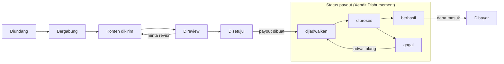

# PRD — Tali, Influencer Campaign Platform (MVP)

Per 6 Oktober 2026

## Ringkasan

MVP Tali adalah PWA mobile-first yang memungkinkan brand menjalankan campaign dengan banyak nano dan micro creator, dan menjamin creator dibayar tepat waktu dengan status yang selalu terlihat. Pasar awal Indonesia, disiapkan untuk ekspansi Asia Tenggara dan global.

**Masalah yang diselesaikan**

- **Creator kecil (ribuan–puluhan ribu followers)** sering tidak tahu kapan dan berapa mereka dibayar, dan status konten mereka tidak jelas.
- **Brand dan agensi** kesulitan mengelola puluhan sampai ratusan creator kecil sekaligus: rekrut, review konten, dan bayar satu per satu.

**Janji brand yang harus dibuktikan setiap fitur:** *Trusted. Dibayar tepat waktu. Membantu creator menghasilkan.* Status pembayaran harus selalu jelas, transparan, dan mudah ditemukan.

**Scope MVP (6 modul):** onboarding creator, daftar dan detail campaign, kirim konten dengan timeline status, sisi brand (buat campaign, setujui creator dan konten), saldo dan riwayat pembayaran creator, serta payout via Xendit Disbursement (mulai dari mode test).

Sumber: dokumen scope terlampir (`CLAUDE.md`, `BRAND.md`, brand kit Tali).

## Tujuan, non-tujuan, dan metrik sukses

MVP berhasil jika satu campaign bisa berjalan ujung ke ujung, dari brief sampai payout, dan setiap creator tahu nominal, tanggal, dan status pembayarannya tanpa bertanya.

**Tujuan**

1. Brand dapat membuat campaign, memilih creator, mereview konten, dan mendanai pembayaran dari satu aplikasi.
2. Creator dapat bergabung ke campaign dengan fee, syarat, deadline, dan tanggal bayar yang terlihat sebelum bergabung.
3. Setiap payout punya status (`dijadwalkan`, `diproses`, `berhasil`, `gagal`) dan tanggal yang bisa dilacak creator dan brand.
4. Aplikasi ringan dan cepat di HP entry-level dengan koneksi lambat.

**Non-tujuan MVP**

- Integrasi API Instagram/TikTok otomatis (verifikasi akun dan metrik konten). MVP memakai input manual.
- Aplikasi native iOS/Android. MVP hanya PWA.
- Marketplace terbuka dengan pencarian creator berbasis algoritma atau rekomendasi AI.
- Chat real-time brand–creator.
- Multi-mata uang dan pasar di luar Indonesia (i18n `en` disiapkan, transaksi hanya rupiah).
- Payout produksi skala penuh sebelum uji di mode test Xendit selesai.

**Metrik sukses**

Target angka belum ditetapkan di scope; diisi bersama tim sebelum pilot.

| Metrik | Definisi | Target |
| --- | --- | --- |
| Payout tepat waktu (north star) | % payout berstatus `berhasil` pada atau sebelum tanggal bayar yang dijanjikan | Ditentukan |
| Payout gagal | % payout berstatus `gagal` dari total payout | Ditentukan |
| Aktivasi creator | % pendaftar yang menyelesaikan onboarding (akun sosial + rekening) | Ditentukan |
| Campaign terisi | % slot creator yang terisi sebelum deadline pendaftaran | Ditentukan |
| Waktu review konten | Median jam dari konten dikirim sampai disetujui/ditolak brand | Ditentukan |
| Brand berulang | % brand yang membuat campaign kedua dalam 90 hari | Ditentukan |

## Persona dan peran pengguna

Tali punya dua sisi pengguna utama dengan bahasa yang disesuaikan, ditambah peran admin internal yang dibutuhkan untuk operasional MVP.

| Peran | Siapa | Kebutuhan utama | Sapaan di copy |
| --- | --- | --- | --- |
| Creator | Nano dan micro creator Instagram/TikTok (ribuan–puluhan ribu followers), banyak memakai HP entry-level | Menemukan campaign yang jelas fee-nya, mengirim konten dengan mudah, dibayar tepat waktu ke bank atau e-wallet | "kamu" |
| Brand / agensi | Tim marketing brand atau agensi yang menjalankan campaign kolektif | Membuat campaign cepat, memilih creator yang cocok, mereview konten, membayar banyak creator sekaligus | "Anda" |
| Admin Tali (asumsi) | Tim operasional internal | Memverifikasi brand dan creator, memantau payout gagal, menangani sengketa | Internal |

Peran admin tidak tertulis di scope, tetapi diperlukan untuk menangani payout `gagal` dan verifikasi manual akun sosial. MVP cukup memakai dashboard internal sederhana.

## Scope fitur per modul

Enam modul MVP mengikuti urutan di scope. Kolom "Di luar MVP" adalah batas yang sengaja ditunda.

| # | Modul | Pengguna | Termasuk MVP | Di luar MVP |
| --- | --- | --- | --- | --- |
| M1 | Onboarding creator | Creator | Daftar (email/Google/OTP), profil, hubungkan akun Instagram/TikTok secara manual (username + bukti), data rekening bank/e-wallet, persetujuan syarat dan privasi | Verifikasi akun via API resmi, eKYC otomatis |
| M2 | Daftar dan detail campaign | Creator | Daftar campaign yang buka, filter dasar (platform, kategori), detail berisi fee, syarat, deadline, tanggal bayar; tombol bergabung | Rekomendasi personal, pencarian lanjutan |
| M3 | Kirim konten + timeline status | Creator, Brand | Unggah draft (foto/video) atau tautan, timeline Diundang → Bergabung → Konten dikirim → Direview → Disetujui → Dibayar, kirim tautan postingan final | Tarik metrik postingan otomatis |
| M4 | Sisi brand | Brand | Daftar brand, buat campaign (brief, fee, kuota, syarat, deadline, tanggal bayar), danai campaign (Xendit invoice/VA/QRIS), setujui/tolak creator, review konten (setujui, minta revisi, tolak) | Tim multi-user per brand, laporan performa lanjutan |
| M5 | Saldo + riwayat pembayaran | Creator | Saldo dan pembayaran berikutnya sebagai elemen utama dashboard, riwayat payout per campaign dengan status dan tanggal | Ekspor laporan pajak |
| M6 | Payout Xendit Disbursement | Sistem, Admin | Payout ke rekening bank dan e-wallet, status `dijadwalkan` → `diproses` → `berhasil`/`gagal` via webhook, jadwal ulang payout gagal, mulai di mode test | Penarikan saldo instan kapan saja oleh creator |

## User flow utama

Alur inti MVP adalah satu partisipasi creator dari undangan sampai dibayar, dan setiap langkahnya terlihat di timeline creator maupun dashboard brand.

Konten yang disetujui membuat payout berstatus `dijadwalkan` untuk tanggal bayar campaign; status `Dibayar` baru tampil setelah Xendit melaporkan `berhasil`. Payout `gagal` diperbaiki (mis. rekening) lalu dijadwal ulang.

**Siapa melakukan apa**

1. **Brand** membuat dan mendanai campaign, lalu mengundang creator atau campaign dibuka untuk umum.
2. **Creator** melihat fee, syarat, dan tanggal bayar, lalu bergabung (dengan atau tanpa persetujuan brand).
3. **Creator** mengirim draft konten sebelum deadline.
4. **Brand** mereview: setujui, minta revisi, atau tolak.
5. **Creator** memposting konten yang disetujui dan mengirim tautannya.
6. **Sistem** menjadwalkan dan mengirim payout pada tanggal bayar; creator dan brand melihat statusnya.

## Kebutuhan fungsional dan acceptance criteria

Setiap kebutuhan punya ID agar bisa dirujuk di tiket dan pengujian. P0 = wajib untuk pilot, P1 = boleh menyusul di MVP.

### M1 — Onboarding creator

1. **FR-1.1 (P0) Daftar dan masuk.** Creator mendaftar dengan email + OTP atau Google via Supabase Auth.
   - Akun baru langsung masuk ke langkah onboarding; sesi bertahan setelah PWA ditutup.
2. **FR-1.2 (P0) Profil creator.** Nama, kota, kategori konten (maks. 3), nomor HP.
3. **FR-1.3 (P0) Hubungkan akun sosial (manual).** Creator mengisi username Instagram/TikTok, jumlah followers, dan screenshot profil sebagai bukti.
   - Status akun: `menunggu verifikasi` → `terverifikasi` / `ditolak` oleh admin, dengan alasan bila ditolak.
4. **FR-1.4 (P0) Data rekening.** Bank atau e-wallet, nomor rekening, nama pemilik.
   - Nomor rekening dienkripsi dan selalu ditampilkan tersamar (`BCA •••4417`).
   - Nama pemilik divalidasi via Xendit bila tersedia; jika tidak cocok, creator diberi tahu sebelum payout.
5. **FR-1.5 (P0) Persetujuan.** Creator menyetujui syarat layanan dan kebijakan privasi (UU PDP) sebelum bisa bergabung ke campaign.

### M2 — Daftar dan detail campaign

1. **FR-2.1 (P0) Daftar campaign.** Kartu campaign menampilkan brand, fee (`Rp 750.000`), platform, deadline, dan tanggal bayar.
   - Daftar kosong menampilkan copy yang mengarahkan, bukan "Tidak ada data".
2. **FR-2.2 (P1) Filter.** Platform (Instagram/TikTok) dan kategori.
3. **FR-2.3 (P0) Detail campaign.** Brief, deliverable, syarat (min. followers, kategori), fee, kuota creator, deadline kirim konten, tanggal bayar.
   - Fee dan tanggal bayar terlihat tanpa scroll di layar 360 px sebelum tombol bergabung.
4. **FR-2.4 (P0) Bergabung.** Creator yang memenuhi syarat menekan "Gabung campaign"; status menjadi `Bergabung` atau `Menunggu persetujuan brand` sesuai pengaturan campaign.
   - Creator yang belum menyelesaikan onboarding diarahkan ke langkah yang kurang.

### M3 — Kirim konten + timeline status

1. **FR-3.1 (P0) Kirim draft konten.** Unggah foto/video ke Supabase Storage atau tempel tautan, plus caption.
   - Batas ukuran file ditampilkan; error menyebut penyebab dan langkah berikutnya.
2. **FR-3.2 (P0) Timeline status.** Setiap partisipasi menampilkan Diundang → Bergabung → Konten dikirim → Direview → Disetujui → Dibayar, dengan tanggal di tiap langkah.
3. **FR-3.3 (P0) Revisi.** Bila brand meminta revisi, creator melihat catatan brand dan dapat mengirim ulang; riwayat versi tersimpan.
4. **FR-3.4 (P0) Tautan postingan final.** Setelah disetujui, creator memposting lalu mengirim URL postingan; brand atau admin mengonfirmasi postingan tayang.
5. **FR-3.5 (P0) Notifikasi.** Web Push + email saat diundang, disetujui, diminta revisi, ditolak, dan saat payout berubah status.

### M4 — Sisi brand

1. **FR-4.1 (P0) Daftar brand.** Nama perusahaan, NPWP (opsional untuk faktur), PIC; diverifikasi admin sebelum campaign tayang.
2. **FR-4.2 (P0) Buat campaign.** Judul, brief, deliverable, platform, syarat creator, fee per creator, kuota, deadline, tanggal bayar.
   - Sistem menghitung total anggaran = fee × kuota + biaya platform.
3. **FR-4.3 (P0) Danai campaign.** Brand membayar total anggaran via Xendit invoice (VA, QRIS); campaign baru tayang setelah pembayaran lunas.
4. **FR-4.4 (P0) Pilih creator.** Brand melihat pelamar (profil, followers, kategori) dan menyetujui/menolak; brand juga dapat mengundang creator.
5. **FR-4.5 (P0) Review konten.** Setujui, minta revisi (dengan catatan), atau tolak (dengan alasan).
   - Konten yang tidak direview dalam batas waktu tertentu ditandai agar ditindaklanjuti admin.
6. **FR-4.6 (P1) Ringkasan campaign.** Jumlah creator per status dan total yang sudah/akan dibayar.

### M5 — Saldo + riwayat pembayaran

1. **FR-5.1 (P0) Kartu pembayaran berikutnya.** Elemen paling menonjol di dashboard creator: nominal, tujuan rekening tersamar, tanggal.
   - Contoh: "Rp 750.000 akan masuk ke BCA •••4417 paling lambat Jumat, 16 Okt."
2. **FR-5.2 (P0) Riwayat pembayaran.** Daftar payout per campaign dengan status, nominal, tanggal, dan alasan bila gagal.
3. **FR-5.3 (P0) Format uang.** Disimpan sebagai integer rupiah, ditampilkan `Intl.NumberFormat('id-ID')` dengan `tabular-nums`.

### M6 — Payout via Xendit Disbursement

1. **FR-6.1 (P0) Penjadwalan.** Saat konten disetujui dan postingan dikonfirmasi, payout dibuat dengan status `dijadwalkan` untuk tanggal bayar campaign.
2. **FR-6.2 (P0) Eksekusi.** Job terjadwal mengirim disbursement (batch) ke Xendit pada tanggal bayar; status menjadi `diproses`.
3. **FR-6.3 (P0) Webhook.** Webhook Xendit yang terverifikasi mengubah status ke `berhasil` atau `gagal`; idempoten terhadap event ganda.
4. **FR-6.4 (P0) Penanganan gagal.** Creator diberi tahu penyebabnya (mis. nama rekening tidak cocok) dan dapat memperbaiki rekening; payout dijadwal ulang. Admin melihat antrean payout gagal.
5. **FR-6.5 (P0) Mode test.** Seluruh alur berjalan di mode test Xendit sebelum kunci produksi diaktifkan via feature flag.
6. **FR-6.6 (P0) Jejak audit.** Setiap perubahan status payout tercatat dengan waktu dan sumber (sistem, webhook, admin).

## Kebutuhan non-fungsional

Kebutuhan non-fungsional MVP dipandu tiga hal: HP spek rendah, data uang dan data pribadi, serta kesiapan ekspansi.

| Kategori | Kebutuhan |
| --- | --- |
| Performa | Mobile-first, diuji di lebar 360 px; aset ringan, tanpa gambar berat; target angka (mis. LCP di jaringan 3G) ditetapkan tim engineering |
| PWA | Installable via Serwist, offline cache untuk shell aplikasi dan riwayat terakhir; manifest dan ikon sesuai brand kit |
| Notifikasi | Web Push via service worker + email (Resend); di iOS push hanya berjalan bila PWA di-install ke home screen, jadi email wajib sebagai cadangan |
| Keamanan data | Row Level Security di semua tabel Supabase; creator hanya membaca datanya sendiri, brand hanya campaign miliknya |
| Privasi (UU PDP) | Minimalkan data yang dikumpulkan; KTP dan rekening dienkripsi; nomor rekening tidak pernah ditampilkan penuh |
| Integritas uang | Nominal disimpan sebagai integer rupiah; webhook Xendit diverifikasi token dan idempoten; jejak audit untuk setiap perubahan status payout |
| i18n | Semua teks UI via next-intl (`id` default, `en`); tidak ada copy yang di-hardcode |
| Aksesibilitas | Kontras teks min. 4.5:1 (3:1 untuk teks ≥ 24 px); touch target min. 44×44 px |
| Brand dan UI | Warna hanya dari token Nila & Limau (`tokens.css`); font Plus Jakarta Sans; logo dari file SVG, bukan teks |
| Infrastruktur | Vercel dan Supabase di region Singapura |
| Observabilitas | Sentry untuk error, PostHog untuk analytics funnel dan metrik sukses |

## Integrasi, data, dan asumsi

Stack mengikuti keputusan di scope: Next.js (App Router) + TypeScript, Tailwind v4 + shadcn/ui, Supabase, dan Xendit untuk uang masuk dan keluar.

**Integrasi pihak ketiga**

| Layanan | Dipakai untuk | Modul |
| --- | --- | --- |
| Supabase Auth | Daftar dan masuk creator serta brand | M1, M4 |
| Supabase Postgres + RLS | Data utama dan kontrol akses | Semua |
| Supabase Storage | File konten dan bukti akun sosial | M1, M3 |
| Xendit Invoice (VA, QRIS) | Brand mendanai campaign | M4 |
| Xendit Disbursement | Payout massal ke bank dan e-wallet creator | M6 |
| Resend | Email transaksional | M3, M6 |
| Web Push | Notifikasi status | M3, M6 |
| Sentry, PostHog | Error dan analytics | Semua |

**Entitas data inti**

| Entitas | Isi utama |
| --- | --- |
| `profiles` | Pengguna dan perannya (creator, brand, admin) |
| `creator_profiles` | Kota, kategori, status onboarding |
| `social_accounts` | Platform, username, followers, bukti, status verifikasi |
| `payout_accounts` | Bank/e-wallet, nomor terenkripsi, 4 digit terakhir, nama pemilik |
| `brands` | Perusahaan, PIC, status verifikasi |
| `campaigns` | Brief, syarat, fee (integer rupiah), kuota, deadline, tanggal bayar, status |
| `campaign_fundings` | Invoice Xendit dari brand dan statusnya |
| `participations` | Creator × campaign dan status timeline beserta tanggalnya |
| `content_submissions` | Versi draft, catatan review, tautan postingan final |
| `payouts` | Nominal, rekening tujuan, status, tanggal, ID Xendit |
| `payout_events` | Jejak audit perubahan status payout |

**Asumsi**

- Brand mendanai penuh anggaran campaign di muka; inilah dasar janji "dibayar tepat waktu".
- Satu partisipasi menghasilkan satu payout sebesar fee campaign (fee tetap, bukan berbasis performa).
- Payout dikirim pada tanggal bayar campaign, bukan ditarik creator kapan saja.
- Verifikasi akun sosial dan konfirmasi postingan tayang dilakukan manual oleh brand atau admin di MVP.

## Rilis bertahap, risiko, dan pertanyaan terbuka

Rilis dibagi empat tahap; tanggal belum ditetapkan di scope. Setiap tahap baru dimulai setelah kriteria tahap sebelumnya terpenuhi.

1. **Fondasi** — setup Next.js, Supabase (RLS), token brand, i18n, PWA shell, landing page. Selesai bila PWA installable dan lolos audit kontras.
2. **Alur creator** — M1, M2, M3 dengan data campaign dari seed/admin. Selesai bila creator uji bisa mendaftar sampai mengirim konten.
3. **Alur brand + uang (mode test)** — M4, M5, M6 dengan Xendit test mode. Selesai bila satu campaign uji berjalan dari pendanaan sampai payout `berhasil` dan `gagal` tertangani.
4. **Pilot tertutup** — kunci produksi Xendit aktif untuk beberapa brand dan creator undangan. Dievaluasi dengan metrik sukses.

**Risiko**

| Risiko | Dampak | Mitigasi |
| --- | --- | --- |
| Payout gagal (rekening salah, nama tidak cocok) | Merusak janji "dibayar tepat waktu" | Validasi nama rekening saat onboarding; notifikasi cepat dan jadwal ulang |
| Regulasi penampungan dana brand sebelum diteruskan ke creator | Bisa memerlukan izin atau skema khusus | Konsultasi hukum; gunakan fitur Xendit yang sesuai (mis. sub-account) |
| Verifikasi manual tidak skalabel | Antrean admin menumpuk saat volume naik | Batasi pilot; rencanakan integrasi API sosial setelah MVP |
| Push notification tidak jalan di iOS tanpa install | Creator melewatkan update status | Email sebagai cadangan; ajakan install PWA |
| Nama "Tali" belum terdaftar merek (kelas 9 dan 42; mirip "TALLY") | Risiko rebranding | Selesaikan cek PDKI sebelum materi dicetak massal |

**Pertanyaan terbuka**

- [ ] Model bisnis: persentase biaya platform dibebankan ke brand, creator, atau keduanya?
- [ ] Pajak: apakah Tali memotong PPh atas fee creator dan menerbitkan bukti potong?
- [ ] Berapa lama batas waktu review konten oleh brand sebelum dianggap disetujui atau dieskalasi?
- [ ] Berapa kali revisi maksimum per konten, dan apa yang terjadi dengan dana jika konten akhirnya ditolak?
- [ ] Apakah creator wajib eKYC (KTP) sebelum payout pertama?
- [ ] Apakah bergabung ke campaign langsung diterima atau selalu perlu persetujuan brand?
- [ ] Domain final: tali.id, tali.app, taliapp.id, atau gettali.com?
- [ ] Target angka untuk metrik sukses dan target performa.
