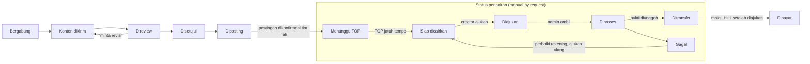

# PRD — Tali, Influencer Campaign Platform (MVP)

Per 6 Oktober 2026

## Ringkasan

MVP Tali adalah PWA mobile-first tempat tim Tali mengkurasi job campaign dari klien brand untuk nano dan micro creator, lalu creator mencairkan fee setelah posting dengan status yang selalu terlihat. Pasar awal Indonesia, disiapkan untuk ekspansi Asia Tenggara dan global.

**Masalah yang diselesaikan**

- **Creator kecil (ribuan–puluhan ribu followers)** sering tidak tahu kapan dan berapa mereka dibayar, dan status konten mereka tidak jelas.
- **Tim Tali** menangani klien brand secara langsung dan perlu satu tempat untuk mengkurasi job, memilih creator, mereview konten, dan memproses pencairan manual ke banyak creator.

**Janji brand yang harus dibuktikan setiap fitur:** *Trusted. Dibayar tepat waktu. Membantu creator menghasilkan.* Status pembayaran harus selalu jelas, transparan, dan mudah ditemukan.

**Scope MVP (6 modul):** onboarding creator, daftar dan detail job, kirim konten dengan timeline status, kurasi campaign oleh tim Tali, saldo dan riwayat pencairan creator, serta pencairan manual by request. Platform yang didukung: Instagram, TikTok, YouTube, Threads, dan X.

**Dua keputusan yang mengubah scope awal:**

1. **Brand bukan pengguna aplikasi.** Klien brand ditangani tim Tali di luar aplikasi; tim Tali yang membuat dan mengkurasi job, memilih creator, dan mereview konten.
2. **Pencairan manual by request.** Setelah posting dan sesuai term of payment (TOP) campaign, creator mengajukan pencairan; admin mentransfer manual maksimal H+1 setelah request dan mengunggah bukti transfer. Xendit Disbursement ditunda ke setelah MVP.

Sumber: dokumen scope terlampir (`CLAUDE.md`, `BRAND.md`, brand kit Tali).

## Tujuan, non-tujuan, dan metrik sukses

MVP berhasil jika satu campaign bisa berjalan ujung ke ujung, dari kurasi job sampai bukti transfer, dan setiap creator tahu nominal, tanggal, dan status pencairannya tanpa bertanya.

**Tujuan**

1. Tim Tali dapat membuat dan mengkurasi job, memilih creator, mereview konten, dan memproses pencairan dari satu dashboard admin.
2. Creator dapat bergabung ke job dengan fee, syarat, deadline, dan term of payment (TOP) yang terlihat sebelum bergabung.
3. Setiap pencairan ditransfer maksimal H+1 setelah creator mengajukan, dengan status, tanggal, dan bukti transfer yang bisa dilihat creator.
4. Aplikasi ringan dan cepat di HP entry-level dengan koneksi lambat.

**Non-tujuan MVP**

- Akun dan dashboard self-serve untuk brand. Klien brand ditangani tim Tali di luar aplikasi.
- Pencairan otomatis via Xendit Disbursement. MVP memakai transfer manual oleh admin.
- Pembayaran brand di dalam aplikasi (invoice, VA, QRIS).
- Integrasi API platform sosial otomatis (verifikasi akun dan metrik konten). MVP memakai input manual.
- Aplikasi native iOS/Android. MVP hanya PWA.
- Chat real-time tim Tali–creator.
- Multi-mata uang dan pasar di luar Indonesia (i18n `en` disiapkan, transaksi hanya rupiah).

**Metrik sukses**

Target angka belum ditetapkan di scope; diisi bersama tim sebelum pilot.

| Metrik | Definisi | Target |
| --- | --- | --- |
| Pencairan tepat SLA (north star) | % pencairan berstatus `ditransfer` maksimal H+1 setelah diajukan | Ditentukan |
| Pencairan gagal | % pencairan berstatus `gagal` dari total pengajuan | Ditentukan |
| Aktivasi creator | % pendaftar yang menyelesaikan onboarding (akun sosial + rekening) | Ditentukan |
| Job terisi | % slot creator yang terisi sebelum deadline pendaftaran | Ditentukan |
| Waktu review konten | Median jam dari konten dikirim sampai disetujui/ditolak tim Tali | Ditentukan |
| Creator aktif berulang | % creator yang menyelesaikan job kedua dalam 90 hari | Ditentukan |

## Persona dan peran pengguna

Aplikasi punya dua peran pengguna: creator dan tim Tali (admin). Brand adalah klien tim Tali, bukan pengguna aplikasi.

| Peran | Siapa | Kebutuhan utama | Sapaan di copy |
| --- | --- | --- | --- |
| Creator | Nano dan micro creator Instagram, TikTok, YouTube, Threads, dan X (ribuan–puluhan ribu followers), banyak memakai HP entry-level | Menemukan job yang jelas fee dan TOP-nya, mengirim konten dengan mudah, mencairkan fee tepat waktu ke bank atau e-wallet | "kamu" |
| Tim Tali — kurator campaign | Tim internal yang menerima brief dari klien brand | Membuat dan mengkurasi job, memilih creator, mereview konten sesuai brief klien | Internal |
| Tim Tali — admin keuangan | Tim internal yang memegang rekening Tali | Melihat antrean pencairan, mentransfer manual maksimal H+1, mengunggah bukti transfer | Internal |
| Brand / agensi (bukan pengguna) | Klien yang memberi brief dan dana ke Tali di luar aplikasi | Menerima laporan konten dari tim Tali (di luar aplikasi pada MVP) | — |

Kurator dan admin keuangan bisa dipegang orang yang sama di awal, tetapi diberi hak akses terpisah agar konfirmasi transfer tercatat atas nama admin keuangan.

## Scope fitur per modul

Enam modul MVP mengikuti urutan di scope. Kolom "Di luar MVP" adalah batas yang sengaja ditunda.

| # | Modul | Pengguna | Termasuk MVP | Di luar MVP |
| --- | --- | --- | --- | --- |
| M1 | Onboarding creator | Creator | Daftar (email/Google/OTP), profil, hubungkan akun Instagram, TikTok, YouTube, Threads, dan X secara manual (username + bukti), data rekening bank/e-wallet, persetujuan syarat dan privasi | Verifikasi akun via API resmi, eKYC otomatis |
| M2 | Daftar dan detail job | Creator | Daftar job yang buka, filter dasar (platform, kategori), detail berisi fee, syarat, deadline, TOP; tombol bergabung | Rekomendasi personal, pencarian lanjutan |
| M3 | Kirim konten + timeline status | Creator, Tim Tali | Unggah draft (foto/video) atau tautan, revisi, kirim tautan postingan final, timeline status dari Diundang sampai Dibayar | Tarik metrik postingan otomatis |
| M4 | Kurasi campaign oleh tim Tali | Tim Tali | Buat job dari brief klien (fee, kuota, syarat, deadline, TOP), undang/setujui creator, review konten (setujui, minta revisi, tolak), konfirmasi postingan tayang | Akun brand, portal laporan untuk klien |
| M5 | Saldo + riwayat pencairan | Creator | Saldo per status (menunggu TOP, siap dicairkan, diajukan, ditransfer), tombol ajukan pencairan, riwayat dengan bukti transfer | Ekspor laporan pajak |
| M6 | Pencairan manual by request | Creator, Admin keuangan | Pengajuan pencairan setelah posting sesuai TOP, antrean admin dengan SLA H+1, transfer manual, unggah bukti transfer, konfirmasi ke creator | Xendit Disbursement otomatis, pencairan instan |

## User flow utama

Alur inti MVP adalah satu partisipasi creator dari bergabung ke job sampai fee ditransfer, dan setiap langkahnya terlihat di timeline creator maupun dashboard tim Tali.

Setelah tim Tali mengonfirmasi postingan, fee menunggu TOP job; begitu jatuh tempo, creator bisa mengajukan pencairan. Admin keuangan mentransfer manual maksimal H+1 setelah pengajuan dan mengunggah bukti transfer, lalu status `Dibayar` tampil di timeline.

**Siapa melakukan apa**

1. **Kurator Tali** membuat job dari brief klien, lalu mengundang creator atau membuka job untuk umum.
2. **Creator** melihat fee, syarat, deadline, dan TOP, lalu bergabung; kurator menyetujui.
3. **Creator** mengirim draft konten sebelum deadline.
4. **Kurator** mereview: setujui, minta revisi, atau tolak.
5. **Creator** memposting konten yang disetujui dan mengirim tautannya; kurator mengonfirmasi tayang.
6. **Creator** mengajukan pencairan setelah TOP jatuh tempo.
7. **Admin keuangan** mentransfer manual maksimal H+1 dan mengunggah bukti transfer; creator menerima notifikasi.

## Kebutuhan fungsional dan acceptance criteria

Setiap kebutuhan punya ID agar bisa dirujuk di tiket dan pengujian. P0 = wajib untuk pilot, P1 = boleh menyusul di MVP.

### M1 — Onboarding creator

1. **FR-1.1 (P0) Daftar dan masuk.** Creator mendaftar dengan email + OTP atau Google via Supabase Auth.
   - Akun baru langsung masuk ke langkah onboarding; sesi bertahan setelah PWA ditutup.
2. **FR-1.2 (P0) Profil creator.** Nama, kota, kategori konten (maks. 3), nomor HP.
3. **FR-1.3 (P0) Hubungkan akun sosial (manual).** Creator menghubungkan satu atau lebih akun Instagram, TikTok, YouTube, Threads, dan X: username/handle, jumlah followers (subscribers untuk YouTube), dan screenshot profil sebagai bukti.
   - Status akun: `menunggu verifikasi` → `terverifikasi` / `ditolak` oleh admin, dengan alasan bila ditolak.
4. **FR-1.4 (P0) Data rekening.** Bank atau e-wallet, nomor rekening, nama pemilik.
   - Nomor rekening dienkripsi dan selalu ditampilkan tersamar (`BCA •••4417`).
   - Admin mencocokkan nama pemilik saat transfer; jika tidak cocok, pencairan ditandai gagal dengan alasan dan creator diminta memperbaiki rekening.
5. **FR-1.5 (P0) Persetujuan.** Creator menyetujui syarat layanan dan kebijakan privasi (UU PDP) sebelum bisa bergabung ke campaign.

### M2 — Daftar dan detail job

1. **FR-2.1 (P0) Daftar job.** Kartu job menampilkan nama brand klien, fee (`Rp 750.000`), platform, deadline, dan TOP.
   - Daftar kosong menampilkan copy yang mengarahkan, bukan "Tidak ada data".
2. **FR-2.2 (P1) Filter.** Platform (Instagram, TikTok, YouTube, Threads, X) dan kategori.
3. **FR-2.3 (P0) Detail job.** Brief, deliverable, syarat (min. followers, kategori), fee, kuota creator, deadline kirim konten, dan TOP (mis. "Bisa dicairkan 7 hari setelah postingan tayang").
   - Fee dan TOP terlihat tanpa scroll di layar 360 px sebelum tombol bergabung.
4. **FR-2.4 (P0) Bergabung.** Creator yang punya akun terverifikasi di platform job dan memenuhi syarat menekan "Gabung job"; status menjadi `Menunggu kurasi` sampai tim Tali menyetujui atau menolak.
   - Creator yang belum menyelesaikan onboarding diarahkan ke langkah yang kurang.

### M3 — Kirim konten + timeline status

1. **FR-3.1 (P0) Kirim draft konten.** Unggah foto/video ke Supabase Storage atau tempel tautan, plus caption.
   - Batas ukuran file ditampilkan; error menyebut penyebab dan langkah berikutnya.
2. **FR-3.2 (P0) Timeline status.** Setiap partisipasi menampilkan Diundang/Bergabung → Konten dikirim → Direview → Disetujui → Diposting → Pencairan diajukan → Dibayar, dengan tanggal di tiap langkah.
3. **FR-3.3 (P0) Revisi.** Bila tim Tali meminta revisi, creator melihat catatannya dan dapat mengirim ulang; riwayat versi tersimpan.
4. **FR-3.4 (P0) Tautan postingan final.** Setelah disetujui, creator memposting lalu mengirim URL postingan; tim Tali mengonfirmasi postingan tayang. Tanggal konfirmasi ini menjadi awal hitungan TOP.
5. **FR-3.5 (P0) Notifikasi.** Web Push + email saat diundang, disetujui, diminta revisi, ditolak, saat job siap dicairkan, dan saat pencairan berubah status.

### M4 — Kurasi campaign oleh tim Tali

1. **FR-4.1 (P0) Data klien brand.** Kurator mencatat klien (nama brand, PIC, catatan) sebagai data internal; klien tidak punya akun.
2. **FR-4.2 (P0) Buat job.** Judul, brand klien, brief, platform dan format deliverable (mis. Instagram Reels, video TikTok, YouTube Shorts, post Threads, post X), syarat creator, fee per creator, kuota, deadline, dan TOP (jumlah hari setelah postingan dikonfirmasi tayang).
   - Job bisa disimpan sebagai draft dan baru tayang setelah dipublikasikan kurator.
3. **FR-4.3 (P0) Kurasi creator.** Kurator melihat pelamar (profil, followers, kategori) dan menyetujui/menolak, atau mengundang creator langsung.
4. **FR-4.4 (P0) Review konten.** Setujui, minta revisi (dengan catatan), atau tolak (dengan alasan).
   - Konten yang belum direview lebih dari batas waktu ditandai di dashboard.
5. **FR-4.5 (P0) Konfirmasi postingan.** Kurator mengecek URL postingan dan menandai tayang; sistem menghitung tanggal siap dicairkan dari TOP.
6. **FR-4.6 (P1) Ringkasan job.** Jumlah creator per status dan total fee yang sudah/akan dicairkan, untuk dilaporkan ke klien di luar aplikasi.

### M5 — Saldo + riwayat pencairan

1. **FR-5.1 (P0) Kartu saldo.** Elemen paling menonjol di dashboard creator: total siap dicairkan, tombol "Ajukan pencairan", dan total menunggu TOP beserta tanggal siapnya.
   - Contoh setelah mengajukan: "Rp 750.000 akan ditransfer ke BCA •••4417 paling lambat Jumat, 16 Okt."
2. **FR-5.2 (P0) Riwayat pencairan.** Daftar pengajuan dengan job terkait, nominal, status, tanggal, bukti transfer, dan alasan bila gagal.
3. **FR-5.3 (P0) Format uang.** Disimpan sebagai integer rupiah, ditampilkan `Intl.NumberFormat('id-ID')` dengan `tabular-nums`.

### M6 — Pencairan manual by request

1. **FR-6.1 (P0) Jatuh tempo TOP.** Setelah postingan dikonfirmasi, fee job berstatus `menunggu TOP` lalu otomatis menjadi `siap dicairkan` pada tanggal TOP.
2. **FR-6.2 (P0) Ajukan pencairan.** Creator memilih satu atau beberapa job yang `siap dicairkan` dan mengirim pengajuan ke rekening terdaftar; status `diajukan` dan tenggat transfer (tanggal pengajuan + 1 hari) langsung tampil.
   - Tombol tidak aktif bila belum ada job siap dicairkan atau rekening belum lengkap, dengan penjelasan.
3. **FR-6.3 (P0) Antrean admin.** Admin keuangan melihat pengajuan diurutkan dari tenggat terdekat, dengan nominal, nama bank, nomor rekening lengkap, dan nama pemilik; pengajuan yang mendekati atau melewati H+1 ditandai.
4. **FR-6.4 (P0) Transfer dan bukti.** Admin menandai `diproses`, mentransfer manual dari rekening Tali, lalu mengunggah bukti transfer (gambar/PDF) dan tanggal transfer; status menjadi `ditransfer`.
   - Status `ditransfer` tidak bisa disimpan tanpa bukti transfer.
   - Creator menerima notifikasi dan dapat melihat bukti transfer.
5. **FR-6.5 (P0) Pencairan gagal.** Admin menandai `gagal` dengan alasan (mis. nama rekening tidak cocok); creator memperbaiki rekening dan mengajukan ulang.
6. **FR-6.6 (P0) Jejak audit.** Setiap perubahan status pencairan tercatat dengan waktu dan admin yang mengubahnya; bukti transfer tidak bisa dihapus, hanya diganti dengan riwayat.

## Kebutuhan non-fungsional

Kebutuhan non-fungsional MVP dipandu tiga hal: HP spek rendah, data uang dan data pribadi, serta kesiapan ekspansi.

| Kategori | Kebutuhan |
| --- | --- |
| Performa | Mobile-first, diuji di lebar 360 px; aset ringan, tanpa gambar berat; target angka (mis. LCP di jaringan 3G) ditetapkan tim engineering |
| PWA | Installable via Serwist, offline cache untuk shell aplikasi dan riwayat terakhir; manifest dan ikon sesuai brand kit |
| Notifikasi | Web Push via service worker + email (Resend); di iOS push hanya berjalan bila PWA di-install ke home screen, jadi email wajib sebagai cadangan |
| Keamanan data | Row Level Security di semua tabel Supabase; creator hanya membaca datanya sendiri; kurator dan admin keuangan punya hak akses terpisah sesuai peran |
| Privasi (UU PDP) | Minimalkan data yang dikumpulkan; KTP, rekening, dan bukti transfer disimpan terenkripsi di bucket privat; nomor rekening lengkap hanya terlihat oleh admin keuangan, ke creator selalu tersamar |
| Integritas uang | Nominal disimpan sebagai integer rupiah; status ditransfer wajib disertai bukti transfer; SLA transfer maksimal H+1 dipantau di dashboard admin; jejak audit untuk setiap perubahan status pencairan |
| i18n | Semua teks UI via next-intl (`id` default, `en`); tidak ada copy yang di-hardcode |
| Aksesibilitas | Kontras teks min. 4.5:1 (3:1 untuk teks ≥ 24 px); touch target min. 44×44 px |
| Brand dan UI | Warna hanya dari token Nila & Limau (`tokens.css`); font Plus Jakarta Sans; logo dari file SVG, bukan teks |
| Infrastruktur | Vercel dan Supabase di region Singapura |
| Observabilitas | Sentry untuk error, PostHog untuk analytics funnel dan metrik sukses |

## Integrasi, data, dan asumsi

Stack mengikuti keputusan di scope: Next.js (App Router) + TypeScript, Tailwind v4 + shadcn/ui, dan Supabase. Xendit (tercantum di stack awal) ditunda karena pencairan MVP dilakukan manual.

**Integrasi pihak ketiga**

| Layanan | Dipakai untuk | Modul |
| --- | --- | --- |
| Supabase Auth | Daftar dan masuk creator serta tim Tali | M1, M4 |
| Supabase Postgres + RLS | Data utama dan kontrol akses per peran | Semua |
| Supabase Storage (bucket privat) | File konten, bukti akun sosial, bukti transfer | M1, M3, M6 |
| Resend | Email transaksional | M3, M6 |
| Web Push | Notifikasi status | M3, M6 |
| Sentry, PostHog | Error dan analytics | Semua |

**Entitas data inti**

| Entitas | Isi utama |
| --- | --- |
| `profiles` | Pengguna dan perannya (creator, kurator, admin keuangan) |
| `creator_profiles` | Kota, kategori, status onboarding |
| `social_accounts` | Platform, username, followers, bukti, status verifikasi |
| `payout_accounts` | Bank/e-wallet, nomor terenkripsi, 4 digit terakhir, nama pemilik |
| `clients` | Brand klien (data internal, tanpa akun) |
| `jobs` | Klien, brief, syarat, fee (integer rupiah), kuota, deadline, TOP (hari), status |
| `participations` | Creator × job, status timeline beserta tanggalnya, tanggal postingan dikonfirmasi, tanggal siap dicairkan |
| `content_submissions` | Versi draft, catatan review, tautan postingan final |
| `payout_requests` | Creator, job yang dicairkan, nominal, rekening tujuan, status, tanggal pengajuan, tenggat H+1, tanggal transfer, bukti transfer, admin |
| `payout_events` | Jejak audit perubahan status pencairan |

**Asumsi**

- Klien brand membayar ke Tali di luar aplikasi; fee creator dibayar dari rekening Tali.
- Satu partisipasi menghasilkan satu fee tetap sebesar fee job (bukan berbasis performa).
- TOP dihitung dalam hari sejak tim Tali mengonfirmasi postingan tayang, dan bisa berbeda per job.
- Verifikasi akun sosial dan konfirmasi postingan tayang dilakukan manual oleh tim Tali di MVP.

## Rilis bertahap, risiko, dan pertanyaan terbuka

Rilis MVP dibagi empat tahap, ditambah satu tahap setelah MVP; tanggal belum ditetapkan di scope. Setiap tahap baru dimulai setelah kriteria tahap sebelumnya terpenuhi.

1. **Fondasi** — setup Next.js, Supabase (RLS per peran), token brand, i18n, PWA shell, landing page. Selesai bila PWA installable dan lolos audit kontras.
2. **Kurasi + alur creator** — M1, M2, M3, M4. Selesai bila kurator bisa membuat job dan creator uji bisa mendaftar sampai postingan dikonfirmasi tayang.
3. **Saldo + pencairan manual** — M5, M6. Selesai bila satu job uji berjalan dari TOP jatuh tempo, pengajuan, transfer, sampai bukti transfer terlihat creator, dan pencairan `gagal` tertangani.
4. **Pilot tertutup** — beberapa klien dan creator undangan, transfer sungguhan dari rekening Tali. Dievaluasi dengan metrik sukses, terutama kepatuhan SLA H+1.
5. **Setelah MVP** — otomatisasi pencairan via Xendit Disbursement bila volume pengajuan melampaui kapasitas admin.

**Risiko**

| Risiko | Dampak | Mitigasi |
| --- | --- | --- |
| Transfer melewati H+1 (admin libur, antrean menumpuk) | Merusak janji "dibayar tepat waktu" | Antrean diurutkan per tenggat, penanda mendekati SLA, notifikasi ke admin cadangan |
| Salah transfer (nominal atau rekening keliru) | Kerugian dana dan kepercayaan | Data rekening lengkap ditampilkan dari sistem, bukan diketik ulang; bukti transfer wajib; audit trail |
| Rekening creator salah atau nama tidak cocok | Pencairan gagal | Cek nama saat transfer; alasan gagal jelas; creator memperbaiki dan mengajukan ulang |
| Pencairan manual tidak skalabel | Beban admin naik seiring jumlah creator | Pantau jumlah pengajuan per hari; siapkan Xendit Disbursement setelah MVP |
| Arus kas: creator dibayar sebelum klien membayar Tali | Tali menalangi fee | Atur TOP job sesuai termin pembayaran klien |
| Push notification tidak jalan di iOS tanpa install | Creator melewatkan update status | Email sebagai cadangan; ajakan install PWA |
| Nama "Tali" belum terdaftar merek (kelas 9 dan 42; mirip "TALLY") | Risiko rebranding | Selesaikan cek PDKI sebelum materi dicetak massal |

**Pertanyaan terbuka**

- [ ] H+1 dihitung hari kalender atau hari kerja? Bagaimana pengajuan di hari Sabtu, Minggu, dan libur nasional?
- [ ] Apakah ada nominal minimum pencairan, dan siapa yang menanggung biaya transfer antarbank atau e-wallet?
- [ ] Apakah creator boleh menggabungkan beberapa job dalam satu pengajuan?
- [ ] Pilihan TOP apa saja yang dipakai (mis. 0, 7, 14, 30 hari setelah tayang)?
- [ ] Pajak: apakah Tali memotong PPh atas fee creator dan menerbitkan bukti potong?
- [ ] Berapa lama batas waktu review konten oleh tim Tali, dan berapa kali revisi maksimum?
- [ ] Apakah creator wajib eKYC (KTP) sebelum pencairan pertama?
- [ ] Apakah klien perlu laporan atau akses baca di aplikasi setelah MVP?
- [ ] Domain final: tali.id, tali.app, taliapp.id, atau gettali.com?
- [ ] Target angka untuk metrik sukses dan target performa.
- [ ] Apakah satu job bisa mencakup lebih dari satu platform (mis. Instagram + TikTok), dan apakah fee-nya dihitung per platform?
